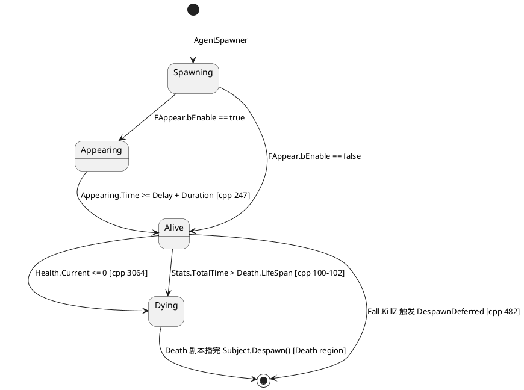
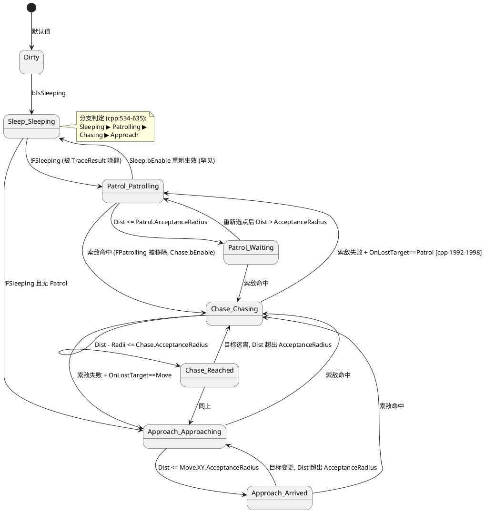
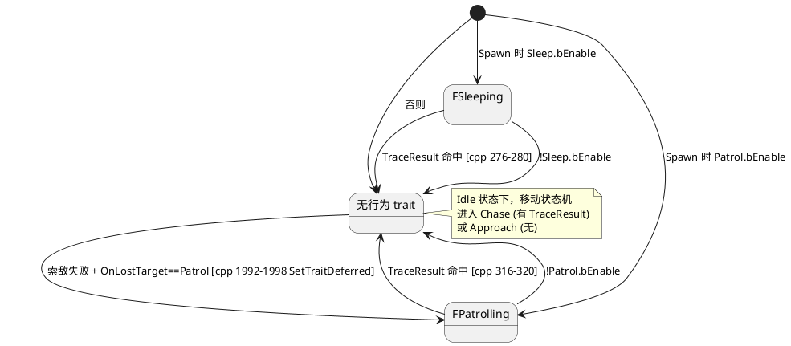
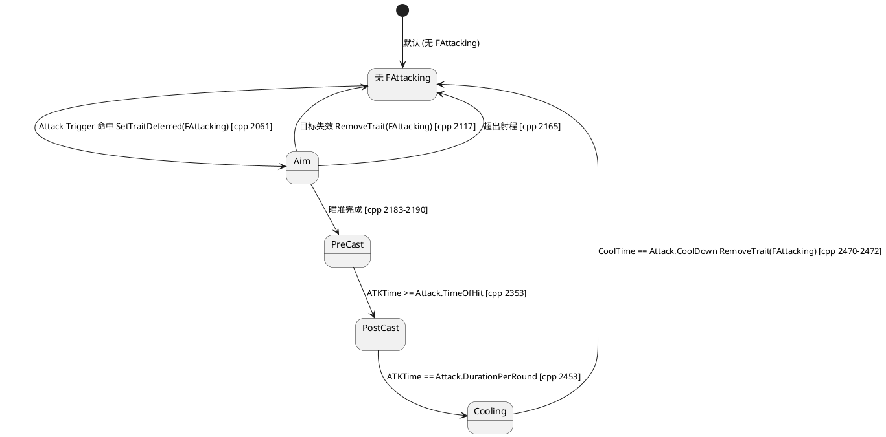
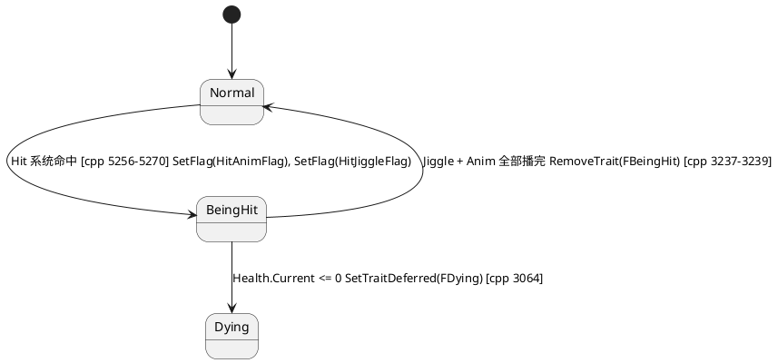

# BattleFrame Agent 状态机

本文档梳理 `Plugins/BattleFrame/Source/BattleFrame/Private/BattleFrameBattleControl.cpp` 中 Agent (entity) 的所有状态与转换。Agent 同时拥有 **多套并行状态系统**——它们正交叠加，而非单一状态机。

---

## 1 · Agent 拥有的状态总览

按"作用层"划分为五套子状态系统：

### 1.1 生命周期 (Lifecycle, tag trait)

| Trait        | 含义         | 进入                                                | 退出                                                   |
| ------------ | ---------- | ------------------------------------------------- | ---------------------------------------------------- |
| `FAppearing` | 出生剧本进行中    | `AgentSpawner.cpp:292` 若 `Appear.bEnable`         | `cpp:247` `Appearing.Time ≥ Appear.Delay + Duration` |
| *（无标记）*      | 正常存活期      | `FAppearing` 移除后                                  | 进入 `FDying` 或被 Despawn                               |
| `FDying`     | 死亡剧本进行中    | `cpp:102` (LifeSpan 超时) / `cpp:3064` (Health ≤ 0) | Death region 结束后 `Subject.Despawn()`                 |
| `FActivated` | 已激活、参与所有系统 | `AgentSpawner.cpp:346` 出生收尾                       | 无（终身持有）                                              |
**下面的状态只出现在 `FActivated` 状态。**

### 1.2 行为模式 (Behavior tag trait — 决定 MoveState 走哪个分支)

| Trait         | 进入条件                                                                                                        | 退出条件                                                                |
| ------------- | ----------------------------------------------------------------------------------------------------------- | ------------------------------------------------------------------- |
| `FSleeping`   | Spawn 时 `Sleep.bEnable` (`AgentSpawner.cpp:303`)                                                            | `!Sleep.bEnable` 或 `Tracing.TraceResult.IsValid()` (`cpp:270-280`)  |
| `FPatrolling` | Spawn 时 `Patrol.bEnable` (`AgentSpawner.cpp:312`)；或索敌失败 + `Patrol.OnLostTarget == Patrol` (`cpp:1992-1998`) | `!Patrol.bEnable` 或 `Tracing.TraceResult.IsValid()` (`cpp:310-320`) |
| `FAttacking`  | Attack Trigger 命中可攻击目标 (`cpp:2061`)                                                                         | 目标失效 / 超出射程 / 攻击完成 (`cpp:2117, 2165, 2472`)                         |
| `FBeingHit`   | 被击中时由 Hit 系统设置 (`cpp:5256-5270`)                                                                            | 全部受击子动效完成 (`cpp:3236-3240`)                                         |

```cpp
// cpp:2009-2078  伪代码
for_each agent matching AgentAttackFilter:
	if (HasFlag(HitAnimFlag)) continue                      // 受击中跳过
	if (HasTrait<FAttacking>) continue                      // 已经在打了
	if (Tracing.TraceResult 是有效活目标):
		if (距离 ≤ Attack.Range + 双方半径):
			SetTraitDeferred(FAttacking)                    // ← 这就是 "Trigger"
			入队 EAttackEventState::Aiming 事件
```

让 Attack Trigger 决定"开打"的关键输入是 Tracing.TraceResult，这是上游的索敌阶段（cpp:1472-2006）写进去的。因此真正的因果链是：
```
索敌 | Trace 阶段（每帧 + 受冷却控制）       // cpp:1473
  └─▶ 找到目标 → 写入 Tracing.TraceResult
			↓
攻击触发 | Attack Trigger 阶段（每帧）      // cpp:2009
  └─▶ 看到有效 TraceResult + 距离够 → SetTrait(FAttacking)
			↓
攻击过程 | Do Attack 阶段（每帧）           // cpp:2081
  └─▶ 推进 EAttackState: Aim → PreCast → PostCast → Cooling
```
三段都是 Tick 内的连续 #pragma region，靠 trait 数据流串起来。没有任何"event 通知"——下一阶段读上一阶段写入的 trait 字段，就像水流过管道。

### 1.3 移动状态 `EMoveState` (`FMoving::MoveState`)

枚举位置：`BattleFrameEnums.h:57`。共 8 个值（1 个无效 + 7 个运行态）：

| MoveState | Tooltip | 进入条件（在 `cpp:515-635` 状态机中） |
|---|---|---|
| `Dirty` | 无效数据 | 初始默认值 |
| `Sleep_Sleeping` | 休眠中 | `bIsSleeping` (有 `FSleeping`) |
| `Patrol_Patrolling` | 巡逻中 | `bIsPatrolling` 且 `Dist > Patrol.AcceptanceRadius` |
| `Patrol_Waiting` | 巡逻点等待 | `bIsPatrolling` 且 `Dist ≤ Patrol.AcceptanceRadius` |
| `Chase_Chasing` | 追逐中 | `Chase.bEnable && bHasValidTraceResult` 且超过 `Chase.AcceptanceRadius` |
| `Chase_Reached` | 已追到 | `Chase.bEnable && bHasValidTraceResult` 且在 `Chase.AcceptanceRadius` 内 |
| `Approach_Approaching` | 前往目标 | 默认分支，未到 `Move.XY.AcceptanceRadius` |
| `Approach_Arrived` | 已抵达 | 默认分支，已到 `Move.XY.AcceptanceRadius` |

> 行为模式 trait 的优先级写死在 `if/else if` 顺序里：`Sleeping ▶ Patrolling ▶ Chasing ▶ Approach`。

### 1.4 攻击子状态 `EAttackState` (`FAttacking::State`)

枚举位置：`BattleFrameEnums.h:45`。攻击进行时的内部阶段：

| State | 含义 | 进入 (cpp 行号) |
|---|---|---|
| `Aim_FirstExec` / `Aim` | 瞄准（首帧/后续） | `FAttacking` 设置时初始为 Aim (`2061`) |
| `PreCast_FirstExec` / `PreCast` | 前摇 | `2183, 2190` |
| `PostCast` | 后摇（命中判定） | `2353` 当 `ATKTime ≥ Attack.TimeOfHit` |
| `Cooling` | 冷却 | `2453` 当 `ATKTime == Attack.DurationPerRound` |
| `Completed` | 完成 | `2470` 冷却到时 → 同步 `RemoveTrait<FAttacking>` |

### 1.5 其它布尔状态位 (Flag)

| Flag | 作用 |
|---|---|
| `AppearAnimFlag` / `AppearDissolveFlag` | 出生动画 / 溶入效果开关 (`cpp:198, 204`) |
| `HitAnimFlag` | 受击动画进行中（短路 Attack Trigger）(`cpp:2028, 3225`) |
| `HitJiggleFlag` | 受击形变进行中 (`cpp:3209`) |

---

## Tick 中的核心流程

### ABattleFrameBattleControl::Tick
- **数据统计 | Statistics**
	- 数据统计统计 | Statistics
- **出生 | Appear**
	- 出生 | Appear
- **移动 | Move**
	- 休眠 | Sleep
	- 巡逻 | Patrol
	- 推动 | Pushed Back
	- 移动 | Move
	- 更新邻居网格 | Update NeighborGrid
- **攻击 | Attack**
	- 索敌 | Trace
	- 攻击触发 | Trigger Attack
	- 攻击过程 | Do Attack
- **投射物 | Projectile**
	- 生成投射物 | Spawn Projectile
	- 投射物运动与伤害 | Projectile Move and Dmg
- **受击 | Hit**
	- 受击反馈 | Hit Reaction
	- 减速马甲 | Slow Ghost Subject
	- 延时伤害马甲 | Temporal Damager Ghost Subject
	- 死亡 | Death
- **游戏线程逻辑 | Game Thread Logic**
	- 生成Actor | Spawn Actor
	- 生成粒子 | Spawn Fx
	- 播放音效 | Play Sound
	- 事件接口 | Event Interface
	- 调试图形 | Draw Debug Shapes
- **渲染 | Rendering**
	- 动画状态机 | Anim State Machine
	- 池初始化 | Init Pooling Info
	- 收集渲染数据 | Gather Render Data
	- 池写入 | Write Pooling Info
	- 发送至Niagara | Send Data to Niagara

---

## 2 · 状态转换流程图

### 2.1 生命周期主流程



### 2.2 移动状态机 `EMoveState`



**转换的判定层 (`cpp:515-635`)**：状态机每帧重算，依赖三个输入

```
bIsSleeping  = HasTrait<FSleeping>()
bIsPatrolling = HasTrait<FPatrolling>()
bIsChasing   = Chase.bEnable && Tracing.TraceResult.IsValid()
```

按 `if/else if` 顺序选大类，再用 `Dist vs AcceptanceRadius` 选 `_ing/_ed` 子状态。

### 2.3 行为模式 trait 流转（决定 MoveState 走哪条分支）



### 2.4 攻击子状态机 `EAttackState`



### 2.5 受击状态 `FBeingHit`



---

## 3 · 五套状态系统的正交关系

同一时刻 Agent 同时持有：

```
[ Lifecycle ]    Appearing | Alive | Dying
       ×
[ Behavior  ]    Sleeping | Patrolling | (none)
       ×
[ MoveState ]    Sleep_Sleeping | Patrol_* | Chase_* | Approach_*
       ×
[ AttackState ]  (none) | Aim | PreCast | PostCast | Cooling
       ×
[ Hit/Anim  ]    Normal | BeingHit (+ flags)
```

约束（写在 Filter 的 `Exclude` 中，见 `cpp:4832-4843`）：

- `Appearing` / `Dying` 排除几乎所有行为系统（Sleep / Patrol / Trace / Attack）
- `Sleeping` / `Patrolling` 排除 Attack 相关系统
- Attack Trigger 还看 `HitAnimFlag` (`cpp:2028`)

---

## 4 · 关键源码位置索引

| 主题 | 文件 : 行 |
|---|---|
| `EMoveState` 定义 | `Public/BattleFrameEnums.h:57` |
| `EAttackState` 定义 | `Public/BattleFrameEnums.h:45` |
| MoveState 状态机主体 | `BattleFrameBattleControl.cpp:515-635` |
| Sleep 退出 | `cpp:270-280` |
| Patrol 退出 | `cpp:310-320` |
| Trace 失败回退到 Patrol | `cpp:1992-1998` |
| Attack 触发 | `cpp:2044-2072` |
| Attack 子状态转换 | `cpp:2109-2472` |
| Dying 进入 (LifeSpan) | `cpp:96-113` |
| Dying 进入 (Health ≤ 0) | `cpp:3064` |
| Appearing 移除 | `cpp:241-248` |
| BeingHit 退出 | `cpp:3236-3240` |
| Filter 定义 | `cpp:4832-4843` |
